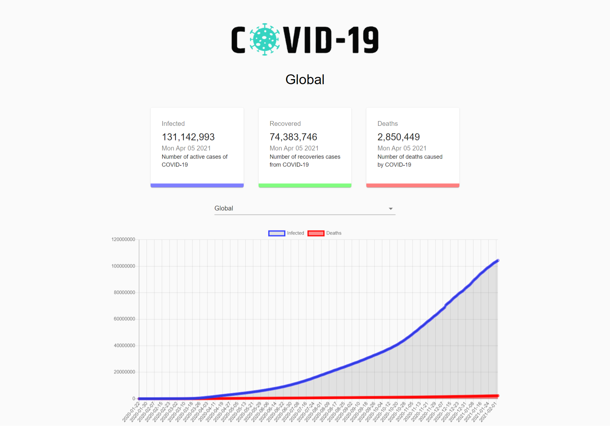

# COVID-19-tracker
#### This is a website which contain the information of COVID-19 whole over the world.

## Features:
+ User can find the condition of COVID-19 whole over the world at a times.
+ User can also find the specific country information. 
## Special-features: 
+ We use two types of chart for user understanding. 
+ LINE CHART...
   * By line chart user can figure out the global condition.
   * which show the increase & decrese condition.
+ BAR CHART...
   * Bar chart is used for showing the specific country information.
+ ANIMATION: Number''s are also animated.

## Technologry: 
+ Reactjs
+ Material-UI
+ Rest API
+ Chart.js
+ CountUp.js
+ Netlify

## WHY YOU WAITING FOR. click below & check it out.
### [Live site](https://simple-covid19.netlify.app/) 

## Take a look :)

